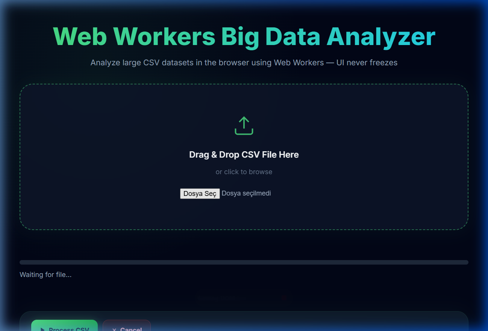
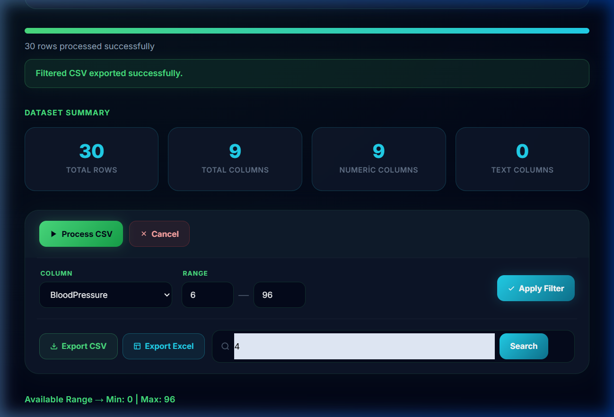
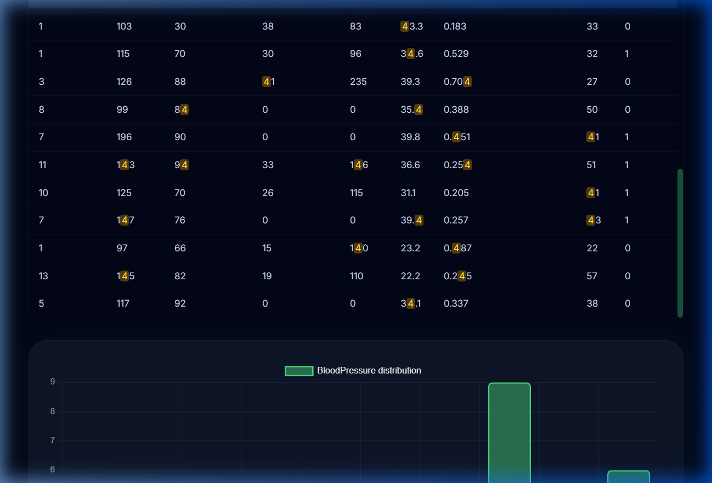

# Web Workers Big Data Analyzer

> **Tarayıcıda 100.000+ satırlık CSV dosyalarını Web Workers ile UI donmadan analiz et**


## 🎓 Öğrenci Bilgileri
- **Ad Soyad:** İlayda Öztürk
- **Öğrenci No:** 23080410302
- **Ders:** BMU1208 Web Tabanlı Programlama
- **Proje Kodu:** P22

## 🎯 Özet

JavaScript tek thread'li bir dildir; büyük dosya okuma veya karmaşık hesaplamalar doğrudan ana thread'de çalıştırıldığında sayfa tamamen donar ve kullanıcı hiçbir etkileşimde bulunamaz. Bu proje, **Web Workers API** kullanarak bu sorunu çözer.

Kullanıcı tarayıcıya büyük bir CSV dosyası (100.000+ satır) yükler. Dosya bir Web Worker'a aktarılır; worker **PapaParse** kütüphanesi ile CSV'yi parse eder, her sütun için temel istatistikleri hesaplar ve sonuçları `postMessage` ile ana thread'e gönderir. Bu süre boyunca UI tamamen responsive kalır — kullanıcı sayfada gezinebilir, filtreleme yapabilir, sonuçları inceleyebilir. Hesaplanan istatistikler **Chart.js** ile histogram olarak görselleştirilir; filtreleme, arama ve dışa aktarma özellikleri de sunulur.

## 🎥 Demo

🔗 **Canlı Demo:** [https://web-workers-big-data-analyzer.vercel.app](https://web-workers-big-data-analyzer.vercel.app)

### Ekran Görüntüleri

| Ana Ekran | Dataset & Kontroller | Arama Sonuçları & Histogram |
|-----------|---------------------|--------------------------|
|  |  |  |

## ✨ Özellikler

### Temel Özellikler
- ✅ **Drag & Drop CSV yükleme** — dosyayı sürükle bırak veya tıkla seç, 100MB+ destekler
- ✅ **Web Worker ile parse** — UI thread'i hiç bloklamaz, sayfa donmaz
- ✅ **Gerçek zamanlı progress bar** — worker'dan `postMessage` ile her 1000 satırda ilerleme bildirimi
- ✅ **Dosya bilgisi** — yüklenen dosyanın adı, boyutu, tipi, son değiştirilme tarihi
- ✅ **Dataset özeti** — toplam satır, toplam sütun, sayısal/metin sütun sayısı

### Analiz & Görselleştirme
- ✅ **Temel istatistikler** — her sayısal sütun için ortalama, medyan, standart sapma, min, max
- ✅ **Histogram grafiği** — seçilen sütunun değer dağılımı, 10 eşit aralıkta (Chart.js)
- ✅ **Sütun seçimi** — analiz edilecek sütunu dropdown'dan seç, grafik anında güncellenir
- ✅ **Min/Max filtresi** — aralığa göre veriyi daralt, grafik ve istatistikler filtreye göre yeniden hesaplanır

### Arama & Export
- ✅ **Tüm kolonlarda arama** — büyük/küçük harf duyarsız, eşleşmeler sarıyla vurgulanır
- ✅ **Arama sonuç tablosu** — en fazla 500 satır gösterilir, histogram'ın hemen üzerinde çıkar
- ✅ **Export CSV** — filtrelenmiş veriyi `.csv` olarak indir
- ✅ **Export Excel** — filtrelenmiş veriyi `.xlsx` olarak indir *(opsiyonel özellik)*

### UX & Performans
- ✅ **İptal (Cancel)** — işlem sırasında worker sonlandırılır, sıfırlanır
- ✅ **Non-blocking loading banner** — işlem sırasında sayfanın üstünde ince banner, tam ekranı kapatmaz
- ✅ **Responsive tasarım** — mobil ve masaüstü uyumlu

## 🧠 Web Workers Neden Gerekli?

```
Web Workers OLMADAN:           Web Workers İLE:
───────────────────            ────────────────
Ana Thread                     Ana Thread       Worker Thread
    │                              │                 │
    ├── CSV parse (BLOCK) ❌        ├── UI güncelle   ├── CSV parse
    │   (sayfa donar)              │                 │
    │   (kullanıcı tıklayamaz)     │◄── progress ────┤
    │                              │                 │
    ├── İstatistik (BLOCK) ❌       │◄── complete ────┤
    │                              │
    ▼                          Kullanıcı her zaman
  Sonuç                        etkileşimde kalır ✅
```

Figma, Google Sheets, Observable gibi profesyonel analiz araçlarının tamamı bu mimariyi kullanır.

## 🧰 Tech Stack

| Katman | Teknoloji | Neden? |
|--------|-----------|--------|
| Frontend | `Vanilla JavaScript (ES Modules)` | Framework bağımlılığı yok, Web Workers API direkt |
| Stil | `Vanilla CSS` — dark mode, glassmorphism | Maksimum kontrol |
| Web Worker | `Web Workers API` — native browser API | UI thread'i bloklamadan arka planda işlem |
| CSV Parse | `PapaParse 5` — worker thread içinde | Worker içinde çalışabilir, streaming destekler |
| Grafik | `Chart.js 4` — histogram | Hafif, kolay entegrasyon |
| Excel Export | `xlsx (SheetJS)` | `.xlsx` formatında dışa aktarım |
| Build | `Vite 8` | Worker bundling, HMR, hızlı build |

## 🏗 Mimari

```
Ana Thread (UI)                    Worker Thread
─────────────────                  ─────────────────
Kullanıcı CSV seçer
        │
        ├─── postMessage(file) ──────────────► PapaParse ile satır satır parse
        │                                              │
        │◄── postMessage(progress) ───────────── Her 1000 satırda %
        │                                              │
        │                                      İstatistik hesapla
        │                                      (ort, medyan, std dev)
        │◄── postMessage(complete) ──────────── rows + stats
        │
   Chart.js ile görselleştir
   Tablo, filtre, export
```

### Veri Akışı (Detaylı)

1. `FileReader` → dosyayı binary olarak okur
2. `worker.postMessage({ file })` → Structured Clone ile worker'a gönderilir
3. Worker içinde `Papa.parse(file, { step, complete })` → streaming parse
4. Her 1000 satırda `postMessage({ type: 'progress', progress: % })` → progress bar güncellenir
5. Parse tamamlanınca tüm sayısal sütunlar için istatistik hesaplanır
6. `postMessage({ type: 'complete', rows, stats })` → ana thread'e gönderilir
7. Ana thread Chart.js ile histogram çizer, stat kartlarını günceller

## 📊 Hesaplanan İstatistikler

Her sayısal sütun için şunlar hesaplanır:

| İstatistik | Formül | Açıklama |
|---|---|---|
| **Ortalama** | `Σx / n` | Değerlerin aritmetik ortası |
| **Medyan** | Sıralı dizinin ortası | Aykırı değerlerden etkilenmez |
| **Standart Sapma** | `√(Σ(x-μ)² / n)` | Dağılım genişliği |
| **Min** | `Math.min(...values)` | En küçük değer |
| **Max** | `Math.max(...values)` | En büyük değer |

## ⚡ Performans

| Dosya Boyutu | Tahmini Satır | Beklenen Süre |
|---|---|---|
| ~1 MB | ~15.000 | 1–2 sn |
| ~5 MB | ~75.000 | 3–8 sn |
| ~20 MB | ~300.000 | 10–20 sn |
| ~50 MB | ~750.000 | 30–60 sn |

> ⚠️ Süreler bilgisayara, tarayıcıya ve sütun sayısına göre değişir.
> Web Worker sayesinde bu süre boyunca **sayfa hiç donmaz**.

## 📖 Nasıl Kullanılır?

1. **CSV Yükle** — "Drag & Drop" alanına dosyayı sürükle veya tıklayıp seç
2. **İşle** — `▶ Process CSV` butonuna tıkla, progress bar ilerler
3. **Analiz Et** — `COLUMN` dropdown'dan bir sütun seç
4. **Filtrele** — `RANGE` alanına Min ve Max değerlerini yaz, `Apply Filter` tıkla
5. **Ara** — Arama kutusuna kelime yaz, tüm sütunlarda arar
6. **İndir** — `Export CSV` veya `Export Excel` ile sonuçları kaydet

## 🚀 Kurulum

### Gereksinimler

- Node.js ≥ 20
- Chrome / Edge / Firefox (güncel sürüm)

### Adım Adım

```bash
# 1) Repo'yu klonla
git clone https://github.com/ilydozttrk/Web-Workers-Big-Data-Isleme.git
cd Web-Workers-Big-Data-Isleme/repo

# 2) Bağımlılıkları yükle
npm install

# 3) Geliştirme sunucusunu başlat
npm run dev
```

Uygulama: http://localhost:5173

### Production Build

```bash
npm run build      # dist/ klasörüne derler
npm run preview    # production build'i local'de test et
```

## 📁 Klasör Yapısı

```
.
├── README.md                        # Bu dosya
├── PROJE-RAPORU-SABLON.docx         # Word formatı rapor
├── LICENSE
└── repo/                            # Kaynak kod
    ├── docs/                        # Ekran görüntüleri ve diyagramlar
    ├── openapi.yaml                 # Web Worker API dokümantasyonu (OpenAPI 3.1)
    ├── index.html                   # Tek sayfa uygulama giriş noktası
    ├── package.json                 # Bağımlılıklar ve scriptler
    ├── vite.config.js               # Vite yapılandırması
    └── src/
        ├── js/
        │   └── main.js              # Ana uygulama mantığı, UI render, event handler'lar
        ├── workers/
        │   └── csvWorker.js         # Web Worker — CSV parse + istatistik hesaplama
        └── styles/
            └── style.css            # Tüm stiller (dark mode, animasyonlar)
```

## ❓ Sık Sorulan Sorular

**S: Dosyalar sunucuya gönderiliyor mu?**  
H: Hayır. Tüm işlem tamamen tarayıcıda gerçekleşir. Dosyan hiçbir yere gönderilmez.

**S: Maksimum kaç satır destekleniyor?**  
H: Teorik bir limit yok; tarayıcının RAM'i kadar. Pratikte 1-2 milyon satır sorunsuz çalışır.

**S: Web Worker olmasa ne olurdu?**  
H: Aynı işlem ana thread'de çalıştırılırsa büyük dosyalarda tarayıcı "sayfa yanıt vermiyor" uyarısı verir ve sekme donar.

**S: Hangi CSV formatları destekleniyor?**  
H: Virgül (`,`) ve noktalı virgül (`;`) ayraçlı, UTF-8 kodlamalı CSV dosyaları. PapaParse ayracı otomatik algılar.

## 🛣 Roadmap

- [x] V1 — Temel analiz, histogram, export, arama
- [ ] V2 — WebAssembly ile SIMD tabanlı aggregation (3-10x hızlı)
- [ ] V3 — DuckDB-WASM ile in-browser SQL query engine
- [ ] V4 — SharedArrayBuffer + Atomics ile çok thread'li işlem

## 🤝 Katkı

Bu proje **BMU1208 Web Tabanlı Programlama** dersi kapsamında **Bitlis Eren Üniversitesi — Bilgisayar Mühendisliği** bölümünde bir final ödevi olarak geliştirilmiştir.

**Ders yürütücüsü:** Dr. Öğr. Üyesi Davut ARI

## 📜 Lisans

MIT © 2026 **İLAYDA ÖZTÜRK** — Tam metin için [LICENSE](LICENSE).

## 🙋‍♀️ İletişim

| | |
|---|---|
| **Öğrenci** | İLAYDA ÖZTÜRK |
| **Öğrenci No** | 23080410302 |
| **E-posta** | ilydoztrk6@gmail.com |
| **Ders** | BMU1208 · Web Tabanlı Programlama |
| **Kurum** | Bitlis Eren Üniversitesi — Mühendislik-Mimarlık Fakültesi |

---

<sub>🤖 Bu projede AI asistanlarından yararlanılmıştır. Tüm mimari kararlar ve tasarım tercihleri öğrenci tarafından yapılmıştır.</sub>
